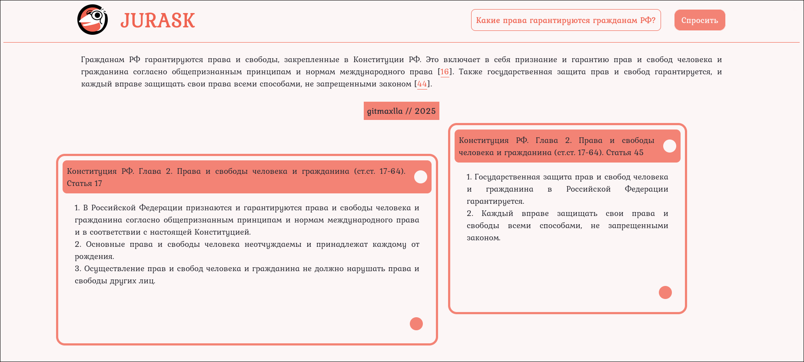
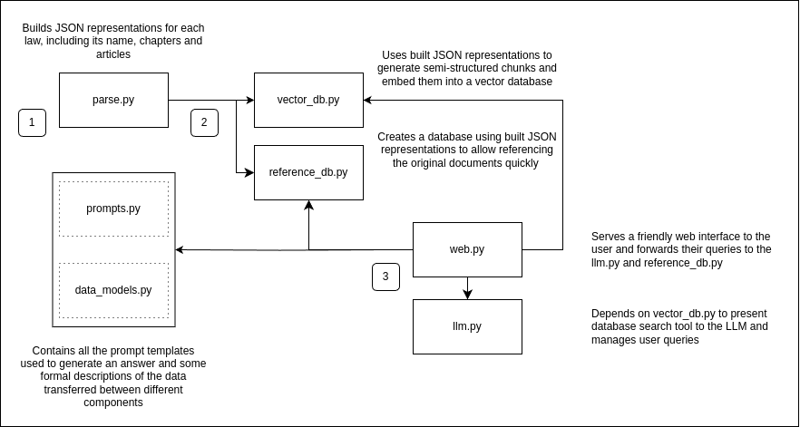

# Jurask Project



> Your intelligent juridical document look-up tool.
> 
---
## What is it?
Jurask is a web-based tool that leverages LLM and RAG technologies to answer juridical questions written in natural language.

## Features
* Runs mostly locally and reasonably fast even on a laptop and uses free API otherwise, making it available for a variety of developers
* Pipelined architecture
  * Jurask is able to go from links to the documents to the working web app fully automatically by running a single command
  * Jenkins-like configuration capabilities
* Multithreaded parsing support
  * (currently through setting MAX_THREADS value in parse.)
* Laws tested
  * Конституция РФ
  * ФЗ "О защите прав потребителей"
  * ФЗ "Об ООО"
  * ФЗ "Об АО"
  * ФЗ "Об образовании"
  * ФЗ "О рекламе"
*  Query language support
   *  Russian
*  Minimalistic yet intuitive web based interface

## Initial Setup
*  API requirements
   *  Groq API key
   *  (Optional) Zilliz Cloud Database

All actions, unless specified, should be done while in the ``jurask/`` folder.
Also, on Windows systems, write ``python jurask`` instead of ``./jurask``.

### 1. Create and set up the environment file (.env)
The project expects you to create a .env file and include

* **GROQ_API_KEY**="..."

and optionally - if remote database is set up -
* **MILVUS_URI**="..." 
* **MILVUS_TOKEN**="..."

variables to be able to connect to external services

### 2. Install project dependencies
> pip install -r requirements.txt


### 3(1). Configure manually:
#### 1. Parse and save data from web
> ./jurask parse

#### 2. Build vector database
> ./jurask embed

#### 3. Build reference database
> ./jurask store

### 3(2). Configure from file:
#### 1. Run the pipeline you have configured beforehand (see below) 
> ./jurask

## Run the app
> ./jurask run

Then, open ``http://localhost:8000`` in your browser.

---

For debug purposes, you may also want to make queries through the CLI. Just run
> ./jurask cli

and wait until you're prompted to enter your question with a dinosaur-styled invitation: ``jurask ---^*>``

(tip: you may write ``exit`` in the CLI mode to exit in a more controlled manner)

## Tests
To run an experimental LLM-based testing, use
> ./jurask test

(This will create a simple log file in ``logs/`` after the tests are finished)

## Technology
App built with [**Langchain**](https://www.langchain.com/) (LLM management),

[**Milvus**](https://milvus.io/) (Vector DB),

[**FastAPI**](https://fastapi.tiangolo.com/) (Web framework),


[**Sentence transformers**](https://sbert.net/) (To run the embedding generation model locally)


[**PyYAML**](https://pypi.org/project/PyYAML/) (To parse the configuration file), 

[**BeautifulSoup4**](https://pypi.org/project/beautifulsoup4/) and [**Clouscraper**](https://pypi.org/project/cloudscraper/) (For webpage parsing)


and some other libraries to load the environment file, show progress bars and whatnot (*see requirements.txt*).

Model [**multilingual-e5-large-instruct**](https://huggingface.co/intfloat/multilingual-e5-large-instruct) has been used to generate vector embeddings for the database.


[**SQLite**](https://www.sqlite.org/) was used to store original laws for dynamic lookup


Free API to access LLMs provided by [**Groq**](https://groq.com/)


Web interface written using just pure HTML/CSS/JS 

## Pipeline
Jurask follows a certain pipeline-like architecture to go from document webpage links to the working web application:



To bring together all the different modules and make Jurask more manageable, configuration by a .yaml Jenkins-like pipeline description has been implemented. You can specify the documents and paths, as well as all included steps, in the corresponding ``jurask.yaml``

Below is an example of such file to demonstrate the syntax and the general structure:

```yaml
paths: # for an easier data management
  database-path: data/db/ # where should database files be stored

  parsed-data-path: data/parsed/ # where should parsed .json files of laws be stored

  dataset-index-path: data/augment/ # where should a "contents" json be stored

stages: # allows for pipelined execution of tasks
  parse:
    skip: # include if the stage should be skipped
    include: all # use to automatically include everything under documents: section
    module: project.parse # see below for custom stages

  embed:
    skip:
    include: all
    except: [constitution] # handy keyword to exclude some documents from include: section
    module: project.vector_db

  store:
    skip:
    include: [constitution, education] # documents can be listed explicitly as well
    module: project.reference_db

  test:
    skip:
    module: project.testing.llm_judge_test
  
  cli:
    skip:
    module: project.llm

  run:
    # no skip: present - this will run
    module: project.web

documents: # data sources
  - id: constitution # name to use in configuration and in the code
    url: https://www.garant.ru/doc/constitution/ # only garant.ru links are supported to parse
    description: Конституция РФ # human-friendly description of the declared data source
  
  - id: consumer_rights
    url: https://base.garant.ru/10106035/
    description: ФЗ "О защите прав потребителей"

  - id: advertisements
    url: https://base.garant.ru/12145525/
    description: ФЗ "О рекламе"

  - id: llc
    url: https://base.garant.ru/12109720/
    description: ФЗ "Об ООО"

  - id: education
    url: https://base.garant.ru/70291362/
    description: ФЗ "Об Образовании"

  - id: jsc
    url": https://base.garant.ru/10105712/
    description: ФЗ "Об АО"
```

### Built-in stages:
* ``parse`` - build the .jsons with law data parsed from the web;
* ``embed`` - build the vector database with chunked embeddings of data from the parsed .json files;
* ``store`` - build the relational database containing all the laws from the parsed .json files for quick referencing;
* ``test`` - test the system with an experimental LLM-based judging method (currently unstable);
* ``cli`` - make queries through the command line;
* ``run`` - launch the web server for the whole system, making it accesible through a browser on a local network;

### On-demand multistage runs
You can run any set of stages from the CLI, for example:
> ./jurask test run

*(keep in mind that non-existent stages will not stop the execution of other ones in the sequence)*

### Custom stages?
In theory it is possible to implement custom add-on stages to jurask.

To do so, specify a new stage in the configuration file and the path to a python module executing it. In that module, declare a function as follows:

```python
def main(documents, paths):
   pass
```

The executor (``jurask``) will then call this method, passing documents: and paths: sections' data to the corresponding parameters

## Known problems
1. A lot of refactoring is required to make the codebase a least somewhat sustainable (for example, the Dataframe class is duplicated between two *_db.py files, a lot of global variables in both Python and Javascript code are present and so on)
2. LLM testing is not robust at all
3. SQLite, as well as Milvus Lite (based on SQLite) are not production-ready
4. Very limited token length and minimal error handling in every part of the project
5. Answer generations fail very often because the RAG pipeline is not tuned well enough
6. Test log directory declaration is missing in the configuration file
7. Prompts are far from being optimally written
8. Frontend quite buggy
9. No automatic generation of supported laws list on the frontend

## Logo mascot lore?
Troodon Juryik does not come from the Jurassic era, but surprisingly you can still jurask him if you want.